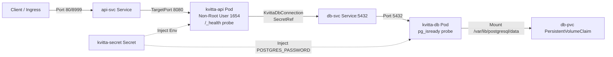

# Requirements

### Overview & Goals
The objective is to fix all critical runtime bugs, security vulnerabilities, data loss risks, and configuration inconsistencies in the `deploy/kubernetes` manifests. Once applied, the manifests will provide a reliable, secure, and production-ready Kubernetes setup for the Kvitta API and PostgreSQL database.

### Scope
- **In Scope:**
  - Fixing container port binding permissions for unprivileged container user ($APP_UID) in .NET 8.
  - Harmonizing port declarations across `api-deploy.yaml` and `api-svc.yaml`.
  - Adding persistent storage (`PersistentVolumeClaim`) for the PostgreSQL database.
  - Replacing hardcoded plaintext credentials with Kubernetes `Secret` resources.
  - Adding liveness and readiness health probes to both API and database workloads.
  - Defining baseline CPU and memory resource requests and limits.
  - Updating `kustomization.yaml` to manage all resources cleanly.
- **Out of Scope:**
  - Modifying C# application code or database migrations.
  - Setting up external CI/CD pipelines or Helm charts.
  - Configuring external ingress controllers or cluster-level TLS certificates.

### User Stories
- **As a DevOps Engineer / Developer**, I want the API container to start without socket permission errors so that the application boots reliably in Kubernetes.
- **As an Operator**, I want database data to persist across pod restarts and rescheduling so that critical data is never lost.
- **As a Security Engineer**, I want credentials stored in Kubernetes Secrets rather than plaintext manifest files so that secrets are protected against exposure in version control and logs.
- **As a Cluster Administrator**, I want health checks and resource limits defined on all pods so that Kubernetes can effectively schedule, monitor, and recover workloads.

### Functional Requirements
- `kvitta-api` must bind to port `8080` (unprivileged) and expose its `containerPort` on `8080`.
- `api-svc` must route incoming traffic (port `80` or `8999`) to `targetPort: 8080`.
- `kvitta-db` must mount a `PersistentVolumeClaim` at `/var/lib/postgresql/data`.
- Secrets for PostgreSQL password and DB connection strings must be extracted to `secret.yaml` and referenced via `valueFrom.secretKeyRef`.
- `kvitta-api` must declare readiness and liveness probes against `HTTP GET /_health` on port `8080`.
- `kvitta-db` must declare readiness and liveness probes using `pg_isready -U postgres`.
- Both workloads must specify reasonable CPU/memory requests and limits.
- `kustomization.yaml` must bundle all resources without namespace conflicts.

# Technical Design

### Current Implementation
The existing manifests in `deploy/kubernetes/` contain several critical blockers:
1. `api-deploy.yaml` configures `ASPNETCORE_HTTP_PORTS: "80"` while running as non-root user `USER $APP_UID`, causing startup crash `SocketException: Permission denied`.
2. Port mismatch between `api-deploy.yaml` (`containerPort: 8999`), `ASPNETCORE_HTTP_PORTS: "80"`, and `api-svc.yaml` (`port: 8999`, `targetPort: 80`).
3. `db-deploy.yaml` has no persistent volume mounted, resulting in ephemeral storage that wipes data on restart.
4. Plaintext passwords (`secret1337`) in `POSTGRES_PASSWORD` and `KvittaDbConnection`.
5. Missing liveness and readiness probes across all workloads.
6. Missing resource requests and limits.
7. Outdated / unpinned images (`postgres:latest`, `erikstrand/kvitta-arm64:latest`).

### Key Decisions
1. **Target Port standard: 8080 for API**: ASP.NET Core 8 defaults to listening on `8080` when run as non-root `$APP_UID`. Setting `ASPNETCORE_HTTP_PORTS: "8080"` and `targetPort: 8080` eliminates permission issues and aligns with standard .NET 8 container conventions.
2. **Kubernetes Secret for Credentials**: Store database credentials and connection parameters in a dedicated `Secret` (`kvitta-secret` or `db-secret`) and reference values via `secretKeyRef`.
3. **Dedicated PVC for PostgreSQL**: Use a `PersistentVolumeClaim` (`db-pvc`) with `ReadWriteOnce` access mode mounted at `/var/lib/postgresql/data`.
4. **Health Check Endpoints**: Utilize the existing `/_health` endpoint (`Kvitta/Program.cs`) for API probes and `pg_isready` CLI for PostgreSQL.

### Proposed Changes

#### 1. Secret Configuration (`deploy/kubernetes/secret.yaml`)
Create secret resource for sensitive database configuration:
- `POSTGRES_PASSWORD`: Base64/string password.
- `KvittaDbConnection`: Connection string pointing to `db-svc:5432`.

#### 2. Database PVC & Deployment (`deploy/kubernetes/db-pvc.yaml` & `db-deploy.yaml`)
- Define `db-pvc.yaml` with 1Gi storage request (`ReadWriteOnce`).
- In `db-deploy.yaml`:
  - Mount `db-pvc` volume to `/var/lib/postgresql/data`.
  - Pin container image to `postgres:16-alpine`.
  - Fetch `POSTGRES_PASSWORD` from `secretKeyRef`.
  - Add `livenessProbe` and `readinessProbe` running `pg_isready -U postgres`.
  - Add `resources.requests` (e.g. 100m CPU, 128Mi RAM) and `resources.limits` (e.g. 500m CPU, 512Mi RAM).

#### 3. API Deployment & Service (`deploy/kubernetes/api-deploy.yaml` & `api-svc.yaml`)
- In `api-deploy.yaml`:
  - Set `ASPNETCORE_HTTP_PORTS: "8080"`.
  - Set `containerPort: 8080`.
  - Fetch `KvittaDbConnection` from `secretKeyRef`.
  - Add `livenessProbe` and `readinessProbe` on `path: /_health`, `port: 8080`.
  - Set CPU and memory requests/limits.
  - Update image reference to `kvitta:latest` (or standardized tag) and `imagePullPolicy: IfNotPresent`.
- In `api-svc.yaml`:
  - Set `port: 80` (or `8999`) and `targetPort: 8080`.

#### 4. Kustomization (`deploy/kubernetes/kustomization.yaml`)
- Add `secret.yaml` and `db-pvc.yaml` to `resources`.
- Keep clean namespace specification for the `kvitta` namespace.

### File Structure
```
deploy/kubernetes/
├── namespace.yaml          # Defines kvitta namespace
├── secret.yaml             # [New] Database credentials and connection string secret
├── db-pvc.yaml             # [New] Persistent volume claim for postgres data
├── db-deploy.yaml          # Updated postgres deployment with probes, resources, PVC mount
├── db-svc.yaml             # Database ClusterIP service on port 5432
├── api-deploy.yaml         # Updated API deployment with port 8080, probes, secret refs, resources
├── api-svc.yaml            # Updated API service routing to targetPort 8080
└── kustomization.yaml      # Bundles all resources for declarative apply
```

### Architecture Diagram


### Risks & Mitigations
- **Volume Provisioning**: Depending on cluster storage classes, default storage class might be missing in local/minikube environments.
  - *Mitigation*: Use standard PVC specifications without restrictive hardcoded storageClassName, allowing cluster default provisioner to bind.
- **First-run Migration Timing**: API might attempt to connect before PostgreSQL has finished initializing data directory.
  - *Mitigation*: `readinessProbe` with `pg_isready` ensures `db-svc` only routes traffic once PostgreSQL is acceptably ready.

# Testing

### Validation Approach
Verify all Kubernetes manifests using schema validation, Kustomize rendering checks, and Kubernetes client dry-run verification.

### Key Scenarios
1. **Kustomize Render Verification**:
   - Run `kubectl kustomize deploy/kubernetes` to verify valid YAML syntax, correct resource generation, and namespace propagation.
2. **Kubernetes Client Dry-Run**:
   - Run `kubectl apply -k deploy/kubernetes --dry-run=client` to ensure all fields, API versions, and schema types conform to the Kubernetes OpenAPI schema.
3. **Port & Routing Alignment Check**:
   - Verify `api-deploy.yaml` has `containerPort: 8080`, `ASPNETCORE_HTTP_PORTS: "8080"`, and `/_health` probe on `8080`.
   - Verify `api-svc.yaml` routes to `targetPort: 8080`.
   - Verify `db-svc.yaml` matches `kvitta-db` selector and routes port `5432` to `5432`.
4. **Secret Reference Validation**:
   - Verify keys in `secret.yaml` match the `secretKeyRef` names and keys declared in `api-deploy.yaml` and `db-deploy.yaml`.
5. **Storage Mounting Validation**:
   - Verify volume name in `db-deploy.yaml` matches `db-pvc.yaml` metadata name and mounts to `/var/lib/postgresql/data`.

### Edge Cases
- Pod startup ordering: API pod readiness probe failing gracefully until DB migrations complete and DB is reachable.
- Missing secret keys: Verify all environment variables sourced from secrets have exact key match.

# Delivery Steps

### * Step 1: Implement database persistence, secret management, and hardening
Introduce secure credential storage and persistent volume configuration for PostgreSQL.

- Create `deploy/kubernetes/secret.yaml` containing database credentials (`POSTGRES_PASSWORD` and connection string components).
- Create `deploy/kubernetes/db-pvc.yaml` declaring a `PersistentVolumeClaim` (e.g. 1Gi `ReadWriteOnce`) for PostgreSQL data.
- Update `deploy/kubernetes/db-deploy.yaml` to pin `postgres:16-alpine`, mount the PVC at `/var/lib/postgresql/data`, inject `POSTGRES_PASSWORD` via `secretKeyRef`, configure liveness/readiness probes with `pg_isready -U postgres`, and define CPU/memory resource requests and limits.

###   Step 2: Fix API port configuration, health probes, and security controls
Align API networking with non-root security boundaries, integrate health endpoints, and set resource limits.

- Update `deploy/kubernetes/api-deploy.yaml` to set `ASPNETCORE_HTTP_PORTS` and `containerPort` to `8080`, allowing the non-root container user (`$APP_UID`) to bind without permission errors.
- Reference the database credentials in `api-deploy.yaml` via Kubernetes Secret (`secretKeyRef`) instead of plaintext strings.
- Add `readinessProbe` and `livenessProbe` targeting the `/_health` endpoint on port `8080`.
- Specify CPU and memory resource requests and limits in `api-deploy.yaml`.
- Update `deploy/kubernetes/api-svc.yaml` so `targetPort` points to `8080`.

###   Step 3: Update Kustomize bundle and validate manifest deployment
Ensure all manifests are properly integrated into Kustomize and pass dry-run validations.

- Update `deploy/kubernetes/kustomization.yaml` to reference all active resources (`namespace.yaml`, `secret.yaml`, `db-pvc.yaml`, `db-svc.yaml`, `db-deploy.yaml`, `api-svc.yaml`, `api-deploy.yaml`).
- Verify manifest syntax and resource transformations using `kubectl kustomize` / `kubectl apply --dry-run=client`.
- Verify consistent naming, selectors, labels, and port mappings across all deployment and service definitions.